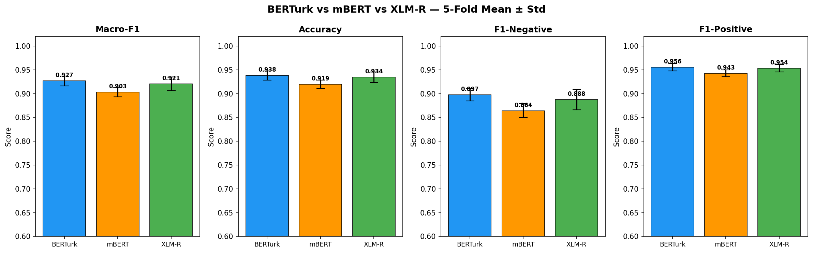
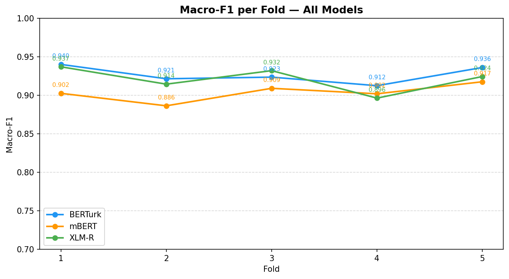

# Aspect-Based Sentiment Analysis on Turkish School Reviews

> **Paper:** *Aspect-Based Sentiment Analysis of Turkish School Reviews: A Comparative Study of Recurrent and Transformer Architectures*

---

## Overview

This repository contains the dataset sample, training scripts, and reproducibility materials for an Aspect-Based Sentiment Analysis (ABSA) study conducted on Turkish school reviews collected from [okul.com.tr](https://okul.com.tr). The study evaluates five model architectures — BiLSTM, BiGRU, mBERT, XLM-R, and BERTurk — under a strict 5-fold cross-validation protocol to determine which approach best captures aspect-level sentiment in Turkish educational discourse.

---

## Dataset

The full dataset comprises **2,620 labeled (sentence, aspect) pairs** derived from **1,533 unique school reviews** across **19 canonical aspect categories**. Due to privacy considerations, only a representative sample is provided in this repository.


| Property                       | Value                                      |
| ------------------------------ | ------------------------------------------ |
| Total (sentence, aspect) pairs | 2,620                                      |
| Unique reviews                 | 1,533                                      |
| Aspect categories              | 19                                         |
| Class distribution             | 69.6% positive, 30.4% negative (2.3:1 ratio) |
| Inter-Annotator Agreement      | Cohen's Kappa = 0.702 (Substantial)        |

### Aspect Categories


| Category (TR)                   | Category (EN)                      |
| -------------------------------- | ----------------------------------- |
| Eğitim Kalitesi                 | Education Quality                   |
| Genel Değerlendirme             | General Evaluation                  |
| Fiziksel İmkanlar               | Physical Facilities                 |
| Öğretmen Kadrosu               | Teaching Staff                      |
| Sosyal ve Kültürel Etkinlikler | Social & Cultural Activities        |
| Yönetim ve İdare               | Management & Administration         |
| Yabancı Dil Eğitimi            | Foreign Language Education          |
| Personel ve Hizmet               | Staff & Service                     |
| Güvenlik                        | Safety & Security                   |
| Ücret ve Finansal               | Fees & Financial                    |
| Yemek ve Beslenme                 | Food & Nutrition                    |
| Rehberlik ve Psikolojik Destek   | Counseling & Psychological Support  |
| Temizlik ve Hijyen               | Cleanliness & Hygiene               |
| Veli İletişimi                  | Parent Communication                |
| Öğrenci Gelişimi                | Student Development                 |
| Ders Çeşitliliği                | Course Variety                      |
| Ulaşım ve Konum                | Transportation & Location           |
| Disiplin                          | Discipline                          |
| Teknoloji                         | Technology                          |

### Data Format

```
data/sample_dataset.csv
```


| Column        | Type | Description                |
| ------------- | ---- | -------------------------- |
| `sentence_id` | int  | Unique review identifier   |
| `sentence`    | str  | Full review text (Turkish) |
| `aspect`      | str  | Aspect category            |
| `label`       | int  | 0 = Negative, 1 = Positive |

**Input format for BERT models:**

```
[CLS] aspect_category [SEP] sentence_text [SEP]
```

---

## Models & Results

All models were evaluated under **5-fold cross-validation** with **sentence-level (sentence_id) partitioning** to prevent data leakage. Weighted cross-entropy loss was applied in all experiments to address class imbalance.

### Main Results (5-Fold Mean ± Std)


| Model              | Accuracy            | Macro-F1            | F1-Negative         | F1-Positive         |
| ------------------ | ------------------- | ------------------- | ------------------- | ------------------- |
| BiLSTM (h=64, L=2) | 0.8121 ± 0.022     | 0.7804 ± 0.020     | 0.6995 ± 0.033     | 0.8613 ± 0.025     |
| BiGRU (h=256, L=2) | 0.8292 ± 0.018     | 0.7999 ± 0.010     | 0.7258 ± 0.020     | 0.8741 ± 0.022     |
| mBERT              | 0.9195 ± 0.009     | 0.9033 ± 0.010     | 0.8640 ± 0.015     | 0.9427 ± 0.007     |
| XLM-R              | 0.9344 ± 0.011     | 0.9207 ± 0.014     | 0.8877 ± 0.022     | 0.9536 ± 0.008     |
| **BERTurk**        | **0.9382 ± 0.010** | **0.9266 ± 0.010** | **0.8975 ± 0.013** | **0.9557 ± 0.008** |

### BERTurk Per-Fold Results


| Fold     | Accuracy   | Macro-F1   | F1-Negative | F1-Positive | Epochs   |
| -------- | ---------- | ---------- | ----------- | ----------- | -------- |
| 1        | 0.9508     | 0.9399     | 0.9145      | 0.9654      | 10       |
| 2        | 0.9340     | 0.9213     | 0.8896      | 0.9529      | 9        |
| 3        | 0.9323     | 0.9234     | 0.8974      | 0.9495      | 10       |
| 4        | 0.9257     | 0.9123     | 0.8780      | 0.9465      | 5        |
| 5        | 0.9483     | 0.9359     | 0.9078      | 0.9640      | 9        |
| **Mean** | **0.9382** | **0.9266** | **0.8975**  | **0.9557**  | **~8.6** |

### Multilingual Comparison





---

## Repository Structure

```
.
├── data/
│   └── sample_dataset.csv        # Representative sample (127 pairs, 19 aspects)
├── scripts/
│   ├── rnn_kfold.py              # BiLSTM + BiGRU 5-fold CV
│   ├── berturk_kfold.py          # BERTurk 5-fold CV
│   └── multilingual_kfold.py     # mBERT + XLM-R 5-fold CV (resume-capable)
├── results/
│   ├── bert_kfold_results.json         # BERTurk fold-level results
│   ├── multilingual_kfold_results.json # mBERT + XLM-R fold-level results
│   └── rnn_kfold_results.json          # BiLSTM + BiGRU fold-level results
├── figures/
│   ├── ML_01_all_models_bar.png        # Mean ± std comparison
│   ├── ML_02_kfold_per_model.png       # Per-fold Macro-F1
│   ├── ML_03_f1neg_comparison.png      # F1-Negative per fold
│   └── ML_04_stability_boxplot.png     # Stability box plots
└── requirements.txt
```

---

## Installation

```bash
# Clone the repository
git clone https://github.com/haksaya/ABSA-Paper-Repo.git
cd ABSA-Paper-Repo

# Create virtual environment
python3 -m venv env
source env/bin/activate        # macOS/Linux
# env\Scripts\activate.ps1    # Windows

# Install dependencies
pip install -r requirements.txt
```

---

## Usage

### Train BERTurk (5-Fold CV)

```bash
python scripts/berturk_kfold.py
```

Results are saved to `results/bert_kfold_results.json`.

### Train mBERT + XLM-R (5-Fold CV)

```bash
python scripts/multilingual_kfold.py
```

The script supports **resume** — if interrupted, it picks up from the last completed fold. Results are saved to `results/multilingual_kfold_results.json`.

### Train BiLSTM + BiGRU (5-Fold CV)

```bash
python scripts/rnn_kfold.py
```

### Notes on Training

- All scripts default to CPU. GPU is used automatically if available (`cuda`).
- BERTurk and mBERT/XLM-R base models are downloaded automatically from HuggingFace Hub on first run (~400–500 MB each).
- Training on CPU takes approximately 3–4 hours per fold for BERT-based models.

---

## Hyperparameters

### BERT Models (BERTurk, mBERT, XLM-R)


| Parameter               | Value                                           |
| ----------------------- | ------------------------------------------------ |
| Learning rate           | 2e-5                                            |
| Optimizer               | AdamW (weight decay = 0.01)                     |
| Batch size              | 16                                              |
| Max epochs              | 10                                              |
| Early stopping patience | 3 (Macro-F1 on validation set)                  |
| Max token length        | 128                                             |
| Warmup                  | 10% linear warmup + linear decay                |
| Gradient clipping       | 1.0                                             |
| Loss                    | Weighted cross-entropy (per-fold class weights) |
| Random seed             | 42                                              |

### BiLSTM / BiGRU


| Parameter      | Value                               |
| -------------- | ------------------------------------ |
| Embedding size | 128                                 |
| Dropout        | 0.3                                 |
| Pooling        | Mean pooling                        |
| BiLSTM         | hidden=64, layers=2 (~250K params)  |
| BiGRU          | hidden=256, layers=2 (~2.1M params) |

---

## Pre-trained Models


| Model   | HuggingFace ID                  | Language(s)   | Params |
| ------- | -------------------------------- | -------------- | ------ |
| BERTurk | `dbmdz/bert-base-turkish-cased` | Turkish       | ~110M  |
| mBERT   | `bert-base-multilingual-cased`  | 104 languages | ~110M  |
| XLM-R   | `xlm-roberta-base`              | 100 languages | ~125M  |

---

## Annotation

The dataset was independently annotated by two domain experts. Disagreements were resolved by a third expert.

- **Inter-Annotator Agreement:** Cohen's Kappa = **0.702** (Substantial Agreement, Landis & Koch 1977)
- Annotation was performed on a stratified sample of 200 (sentence, aspect) pairs (140 positive, 60 negative) before extending to the full dataset.

---

## Citation

If you use this dataset or code in your research, please cite:

```bibtex
@article{aksaya2026absa,
  title   = {Aspect-Based Sentiment Analysis of Turkish School Reviews:
             A Comparative Study of Recurrent and Transformer Architectures},
  author  = {Aksaya, Harun and G{\"u}lse{\c{c}}en, Sevin{\c{c}}},
  journal = {Electronics},
  year    = {2026},
  note    = {Under review}
}
```

---

## License

The code in this repository is released under the **MIT License**.
The dataset sample is released for **research purposes only**. Original reviews are the property of their respective authors on okul.com.tr.
